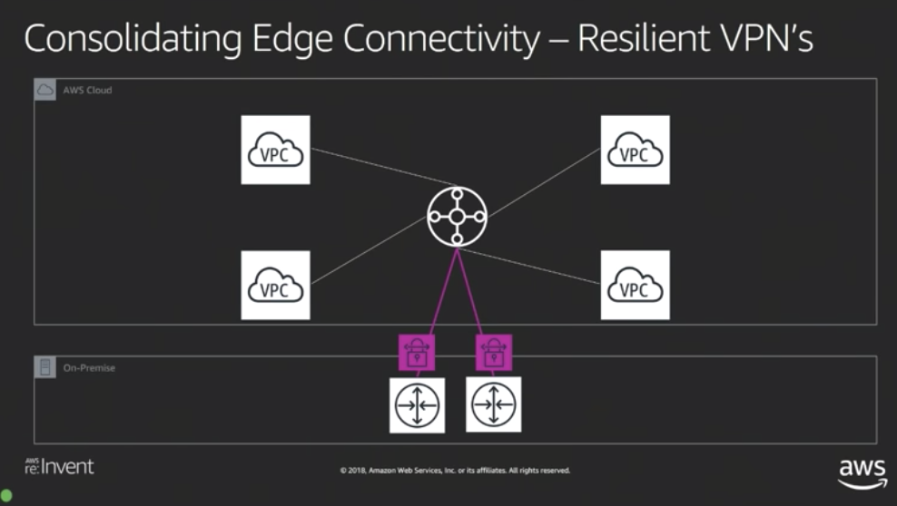

# AWS Transit Gateway

AWS Transit Gateway is a service that allows customers to interconnect thousands of Virtual Private Clouds (VPCs) across accounts and on-premise networks.

It is not a physical device. It is a fully managed AWS service.

It is like a Transit VPC, but managed by AWS?

It can have several route tables.

## VPC Peering

The VPC peering is a connection between two VPCs. 

Instead of creating a VPC Peering mesh between dozens of VPCs, AWS Transit Gateway enables the same, but centralizing management and configuration.

## VPN Connection

The VPC connection enable a VPC to connect to on-premise private networks.

Instead of having to create a VPN Connection to each VCP in order to connect to the on-premise network, AWS Transit Gateway.

## Concepts

- Interconnecting VPCs at scale
- Consolidates edge connectivity
- Flexibility with routing domains

### Router Domain

